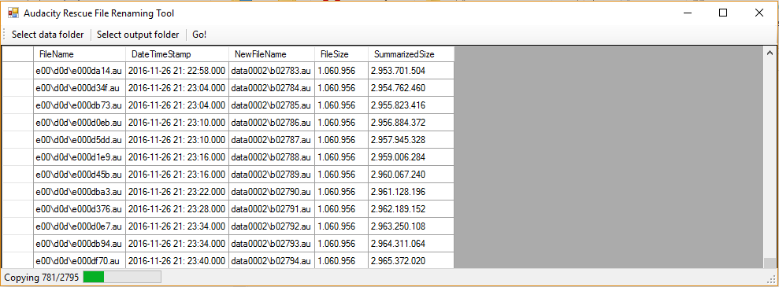

# AudacityRecoveryFileRenamingTool

## General purpose of this tool
Renames files for Audacity project recovery tool

## How does this tool works?
This tool works in preparation of the Audacity recovery tool at http://manual.audacityteam.org/man/recovering_crashes_manually.html respectively http://www.mesw.de/audacity/recovery/

After all .au data files are in correct order (done by this tool), the Audacity recovery tool can successfully join all these .au files in right order into .wav files

## Exemplary Screenshot

